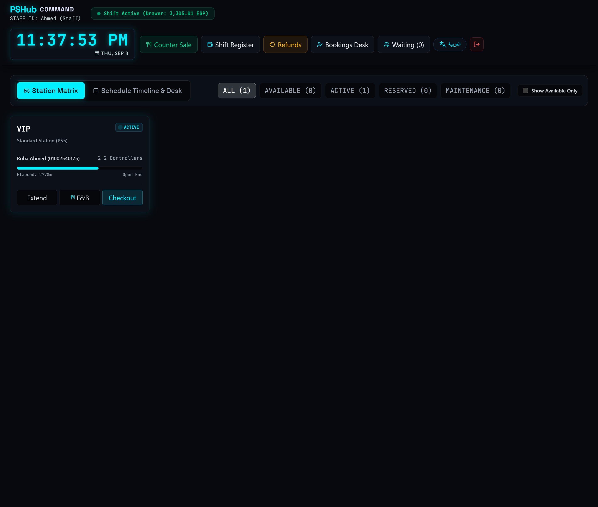
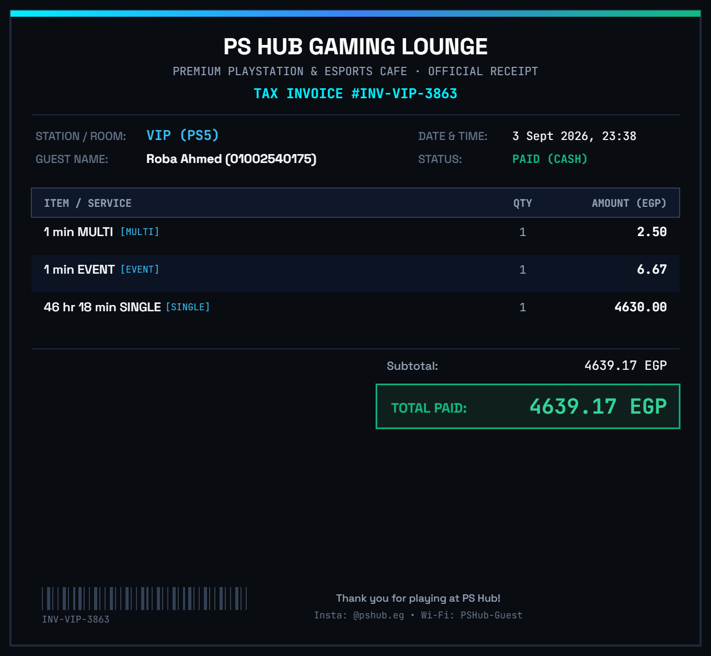
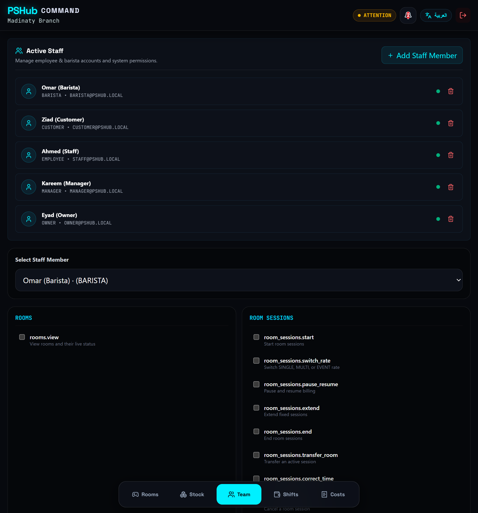

# PsHub#

Gaming venue management platform built to manage station sessions, cashier operations, billing, F&B sales, expenses, reporting, and management auditing.

> This repository is a public showcase of the project.  
> The production source code is private.

## Overview

PsHub is an operations platform designed for gaming venues with multiple station types, pricing models, cashier shifts, and F&B services.

The system handles the full operational cycle from starting a station session to invoicing, shift closing, expense tracking, and management reporting.

## Core Features

- various station types: VIP, Regular, Workstation, Netflix, and Match
- configurable pricing modes
- Timed gaming sessions with automatic billing
- Pricing mode switching during active sessions
- Cashier shift management
- Invoice generation for every order
- F&B orders with or without station sessions
- Session and order history
- Shift income and expense tracking
- Cash deductions with reasons and audit history
- Manager dashboards and operational reports
- Cashier performance tracking
- Role-based access for operational staff
- Full transaction and activity auditing

## System Roles

- Customer
- Cashier
- Barista
- Manager
- Owner

## Tech Stack

### Backend
- Node.js
- TypeScript
- Fastify.js
- REST APIs
- PostgreSQL
- drizzle
- JWT Authentication

### Frontend
- React
- TypeScript
- Tailwind CSS

### Infrastructure
- Linux
- VPS
- Docker
- Nginx
- Coolify

## Main Modules

### Station Management

Manage station availability, type, status, pricing, and active sessions.

### Session Management

Track session start/end times, pricing changes, duration, and calculated charges.

### POS & Orders

Create orders containing gaming sessions, F&B products, or both.

Every completed order generates an invoice.

### Cashier Shifts

Track:

- Shift start/end
- Total sales
- Number of orders
- Cash deductions
- Operational expenses
- Closing balance

### Management Dashboard

Managers can review:

- Active cashier shifts
- Revenue
- Orders
- Session history
- Expenses
- Deductions
- Audit records

## Screenshots

### Cashier Dashboard

### Invoice Preview

### Manager Dashboard

## Architecture

PsHub follows a layered application architecture:

Client  
↓  
REST API  
↓  
Controllers  
↓  
Services  
↓  
Repositories  
↓  
PostgreSQL

Authentication and authorization are handled through JWT and role-based permissions.

## Project Status

Active development.

## My Role

System architecture, backend development, database design, API design, frontend development, UI/UX, deployment, and product planning.

---

Developed by **Eyad Aboelftoh / The Software Guys**
